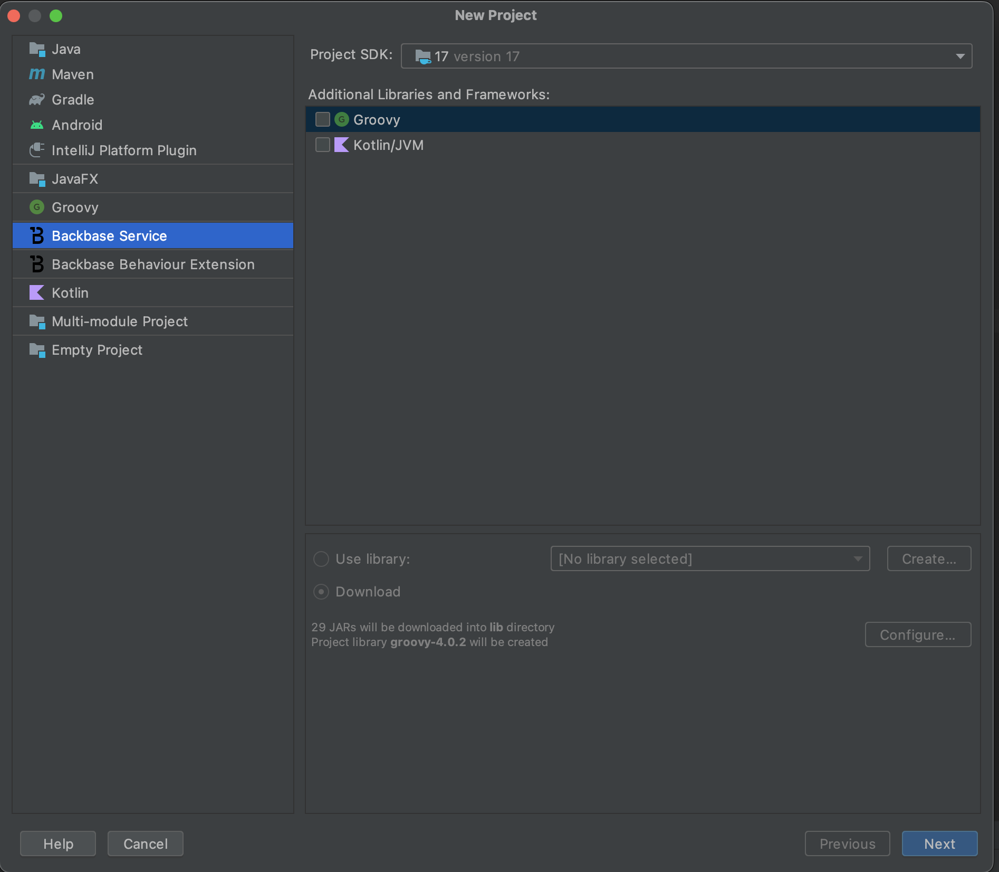
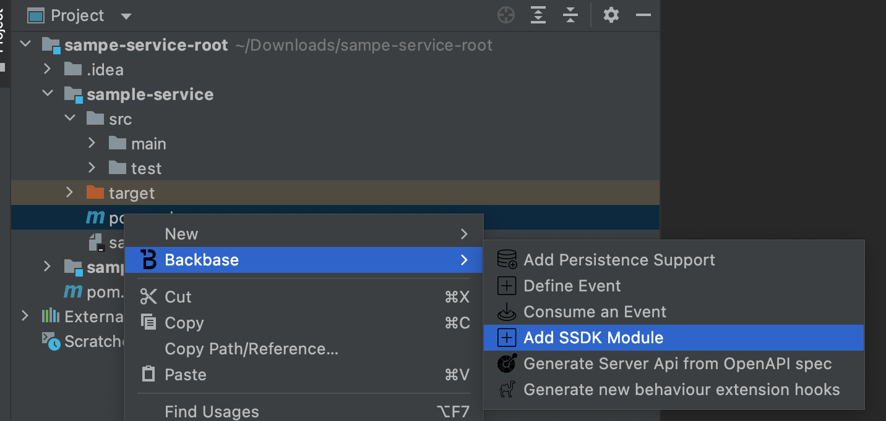
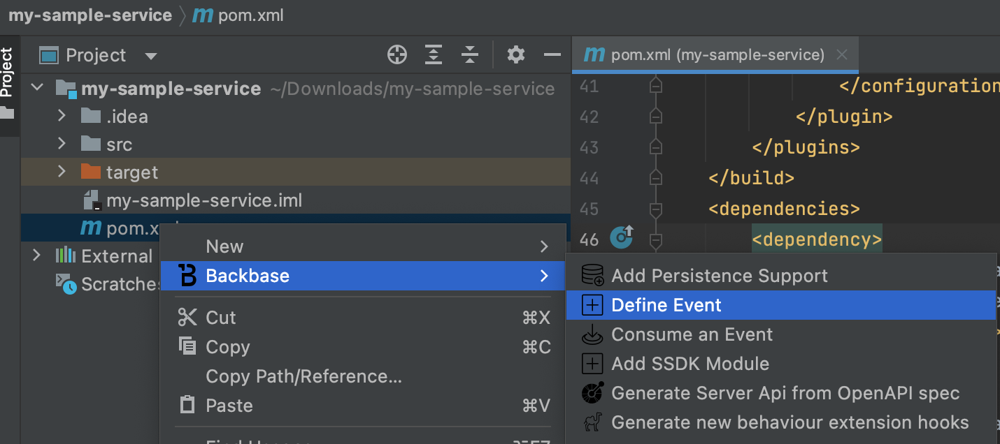
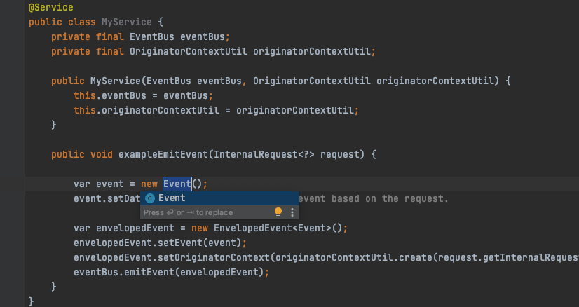
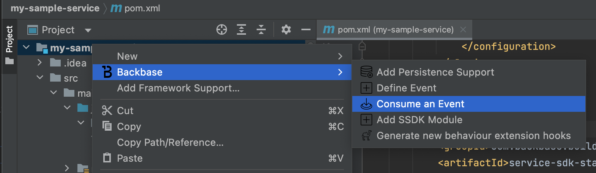
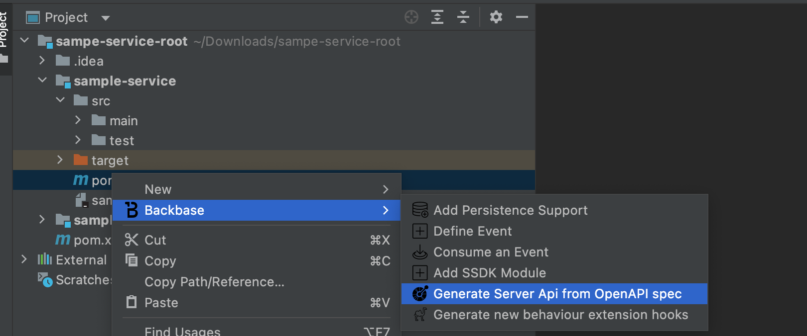

# Backbase Service Toolkit

This IntelliJ Platform Plugin is going to help you to create and maintain your own Backbase backend services. It would make it easier for you to follow [Community Backbase Documentation](https://community.backbase.com/) with simple Intellij options. 

Following are ways you can use the plugin.

## Create a New Backbase Project

Create a new backbase service based on [core-service-archetype](https://community.backbase.com/documentation/ServiceSDK/latest/create_a_core_service).

Fill out your project details.

Select project location.

This will create a maven project with `service-sdk-starter-core` as parent.

## Add SSDK Module

Right click on the project -> `Backbase` menu -> Add SSDK Module

Select dependencies you want to include

## Add Persistence Support

Right click on the project -> `Backbase` menu -> Add Persistence Support

Select according to your needs

Based on your choice in the previous step, require dependcies will be added to your pom.xml, liquidbase sample xml created etc.

## Events Support

### Define Event

Right click on the project -> `Backbase` menu -> Define Event

Enter a name for your event

This will create a event json file and will add require dependencies to your pom.xml. Change the json with your needs and run `mvn install` to generate code.

You can generate code based on above event in your service class

Change the name according to the class generated in the previous step

### Consume Events

Make sure you have already created an event json file as described in define events. 
If you are consuming events from other services, make sure you have copied the json contents from their repo to your own file.
Generate POJO's either by running `mvn install` or clikcing `Generate Sources` from maven tab in IntelliJ

Right click on the project -> `Backbase` menu -> Consume and Event

This should open a box showing all the defined events. (Again whose code is generated, if not generate the code)

On selecting the class, it should generate a sample code for that

## Create a New Behaviour Extension Project

Behavior extensions enable you to customize the workflow of your service. Create a new [extensions project](https://community.backbase.com/documentation/ServiceSDK/latest/extend_service_behavior)

Enter the details of the backbase service you want to extend that supports camel routes.

Enter the maven details for the generated project

Enter project location

This will create a maven project with required dependencies and structure.

Create a hook -> `Backbase` menu -> Generate new behaviour extension hooks 

Enter hook name and select route type

Based on your above selection it will create require config class

## Open API Support

### Generate Client

To generate a client using the backbase-openapi tool. Specs for which clients need to be generated is already downloaded in the resources folder. Right click of a spec yaml 

Based on file selection, the dialog box will be populated accordingly. Change if needed

It will add the necessary dependencies in pom and the boat maven plugin with execution. It will also create a configuration class. Run `mvn install` to generate code.

### Generate API

Right click on the project -> `Backbase` menu -> Generate Server API From Openapi Specs

This should open file selection box , where you can select the spec to implment.

On selection, a Dialog box would open with opinionated values and file path.

On selection, the required dependencies and plugin will be added in the pom.xml. Generated sources using `mvn install`

## Search Golden Samples

We have [Backbase Golden Sample](https://github.com/Backbase/golden-sample-services) example which includes best practices to work with microservices and Backbase SDKs. 

You can seach for a particular text from your project files

This will search the same in golden samples examples project

